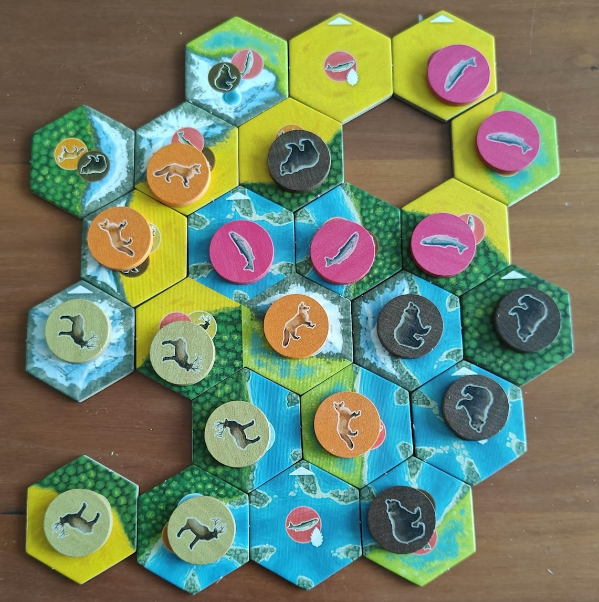
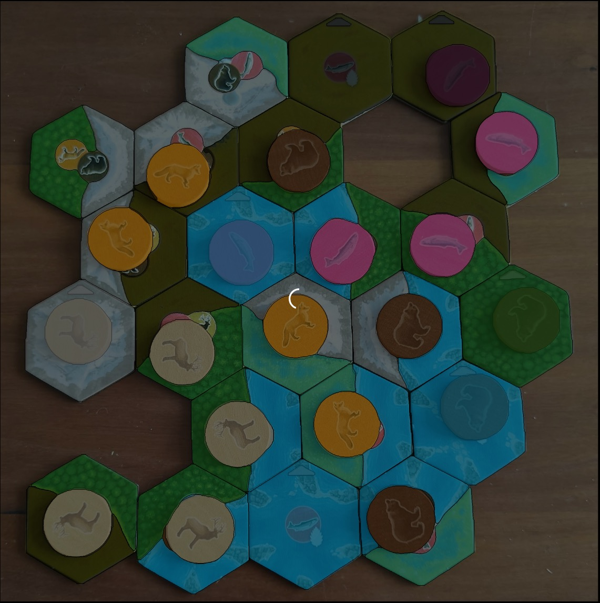
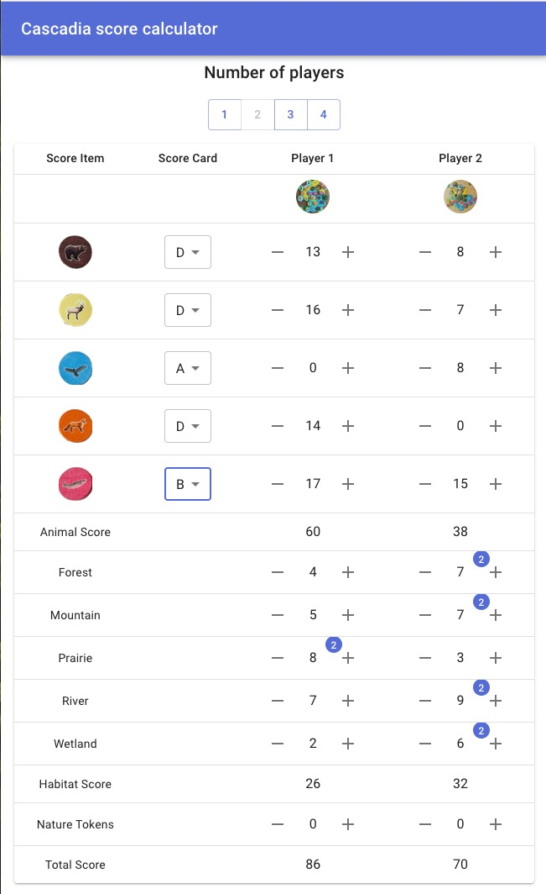

# Cascadia Score Calculator Issues Tracker

This repository serves as the issues tracker for the Cascadia Score Calculator project.
While the project is not open source yet, you can report issues or suggestions [here](https://github.com/j0rd1smit/cascadia-score-calculator-issues/issues/new).

## What is the Cascadia Score Calculator?

The Cascadia Score Calculator is a computer vision-based application designed to automatically calculate game scores from an image of the game board.
You can access the application at [cascadia.jordismit.com](https://cascadia.jordismit.com).

### How It Works

1. **Capture Image**: Take a picture of the game board.
2. **Upload Image**: Upload the image to the application.
3. **Computer Vision Analysis**: Several computer vision models analyze the image to detect all game objects.
4. **Relationship Inference**: The relationships between the detected objects are inferred based on their positions.
5. **Score Calculation**: Scores are calculated based on the detected game objects and their relationships.
6. **Score Overview**: The calculated scores are displayed to the user.

### Image analysis example
Here is an example of an image before and after analysis:

| Original Image of the Game Board | Detected Game Objects After Analysis |
|----------------------------------|--------------------------------------|
|            |                 |

As you can see, the application detects all relevant game objects such as tiles, habitats, and animals.
All these objects are then used to calculate the final score.

### Score Overview Example

After analysis, users are redirected to a score overview page. 
If images are provided for multiple players, the overview will display individual scores and bonuses for larger habitats.
By default, the application assumes a 2-player game with A-scoring cards. 
You can adjust the number of players and scoring cards without re-uploading and re-analyzing the image.
If the computer vision model makes a mistake, users can manually adjust scores using the +/- buttons.

